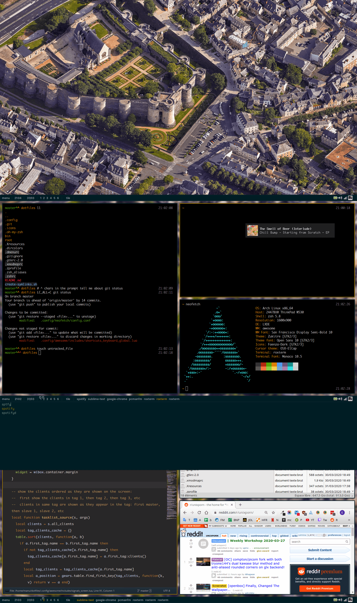

A few stuff I keep here to ease up configs across my machines:

* awesome wm 4
* rofi
* oh my zsh with a home made theme
* dunst
* gtk 2 and gtk 3
* roxterm/xresources colors
* ~lxsession~ not used anymore
* lightdm
* ~sublime text 3, with home made snippets~ not used anymore
* xmodmap: using an azerty layout on a qwerty keyboard, moving a few keys on different keyboards
* picom
* common bash scripts: easily add things to the path, start a server, toggle my thinkpad touchpad.

The repo is structured as if it was my home directory, so you can copy and paste stuff directly or create the symlinks with the given script. If using the create-symlinks script, be sure to change paths accordingly.

Also note I assume home directory is often `/home/manu` in a few of those configs, especially awesome wm, so if you want to copy you should search and replace this.

A few stuff that should be at the root of the system is located in root/ and is rather specific to my setups and not really interesting to share.

